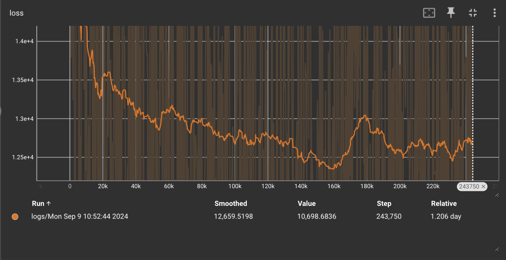

# Diffusion
Simple implementations of DDPM and EDM sampled and trained on CIFAR-10, from the papers, Denoising Diffusion Probabalistic Models (Ho et. al) and Elucidating the Design Space of Diffusion Models (Karras et. al)

  

## Model Architecture
The model is a UNet featuring residual connections and channel-wise self-attention at the lower levels. The architectures closely resembles the UNet used in DDPM, though there exist a few differences since I avoided peeking at the various implementations (namely [Ho](https://github.com/hojonathanho/diffusion/blob/master/diffusion_tf/models/unet.py), [Song](https://github.com/yang-song/score_sde/blob/main/models/ddpm.py#L32), and [Nvidia's Modulus]()) 

## EDM vs DDPM
This repo includes losses and samplers from the EDM and DDPM papers, though, I only trained the model using the DDPM formulation on a subset of CIFAR-10 due to my compute limitations.

I was intially inspired by a blog post written by Miika Aittala [blog post on the NVIDIA developer forum](https://developer.nvidia.com/blog/generative-ai-research-spotlight-demystifying-diffusion-based-models/) highlighting findings from the "Elucidating the Design Space of Diffusion-Based Generative Models" paper. I was familiar with stochastics and numerical analysis, so the blog post was very intuitive to me. However, the findings of the work reframe previous formulations into a standardized SDE framework. The simple model was the product of years of diligent theoretical reparameterizations, bound-setting, and experimental results.

Originally, the "Denoising Diffusion Probablistic Model" popularized diffusion models following Jascha Sohl-Dickstein's foundational paper, "Unsupervised Learning using Non-equilibrium Thermodynamics." I read both, but the latter was particularly dense. I could follow along with both papers line-by-line(with some hand-wavy acceptance focusing on intuition), but only felt confident in my understanding after doing some exercises proving and verifying some of their steps in Christopher Bishop's [Deep Learning](https://www.bishopbook.com/) which is a free and terrific resource.

## Data + Implementation Notes

- Dataset was a single class of CIFAR-10 (cars) ran for 200mimg (~6250 epochs) similar to the EDM paper 
- The one config file lists the layer dimensions, attention information, and more, but it is loosely rooted in the various DDPM implementation configurations by Ho, Song, and Karras

## What I learned
This was the first (perhaps small) "backbone" I implemented from scratch. Most problems and datasets I've used are simple enough to have tremendous flexibility in both the model architecture and training/optimization parameters. Additionally, diffusion models are theoretically dense (math is hard), and digesting their reformulations from 2020 til now couldn't be rushed, so catching up is an ongoing process.

### some high level items that improved performance
- Gradient clipping (various techniques but I used L2 on gradients) was critical—several times when using both DDPM and EDM losses, I witnessed in real-time the horror of seeing gradients explode... it's very sad. Though, the EDM paper's appendix pointed out they saw better results without it. It worked for me, however.
- Scaling outputs on skip connections
- Attention layers increase model capacity in UNets and initial MNIST testing performed terrible without it
- Learning rate for diffusion is especially important for convergence speed since it has to train for so long—2e-4 worked significantly better (and faster) than 1e-4 some reported

## Final thoughts
Bottomline—diffusion is the most dense topic I have studied in a while. I can stumble through the theory, but I haven't mastered it enough to manipulate anything like I could imagine doing with GANs... I'll definitely look into this again in the (perhaps far) future after gaining more experience with probability. I saved my logs and weights, but will upload the latter to HuggingFace if anyone's curious.

  

